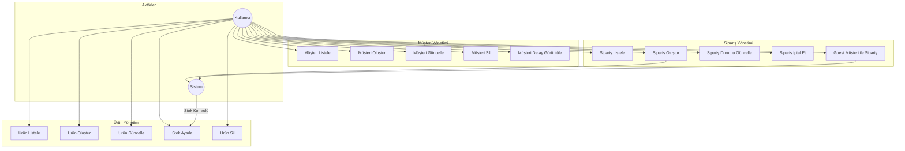
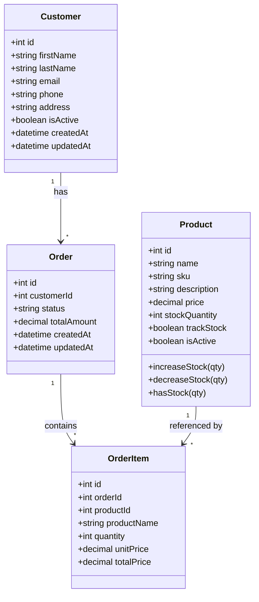
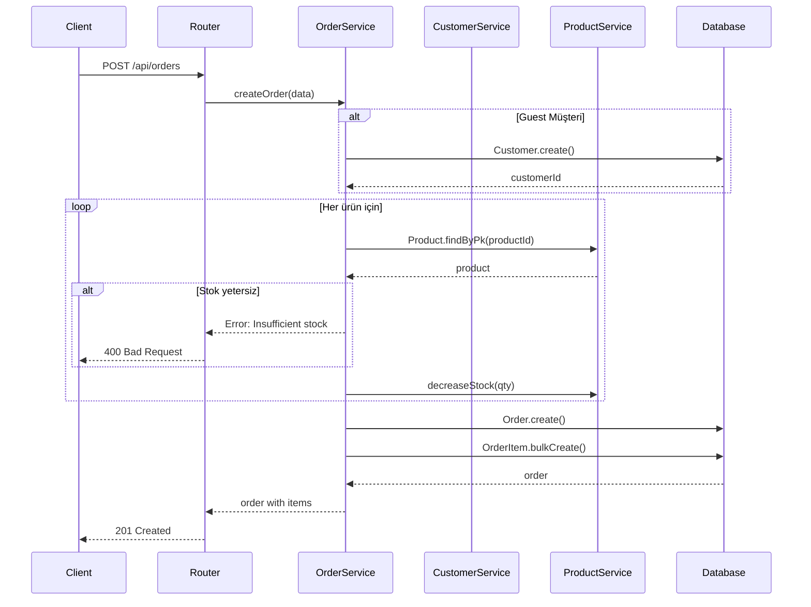
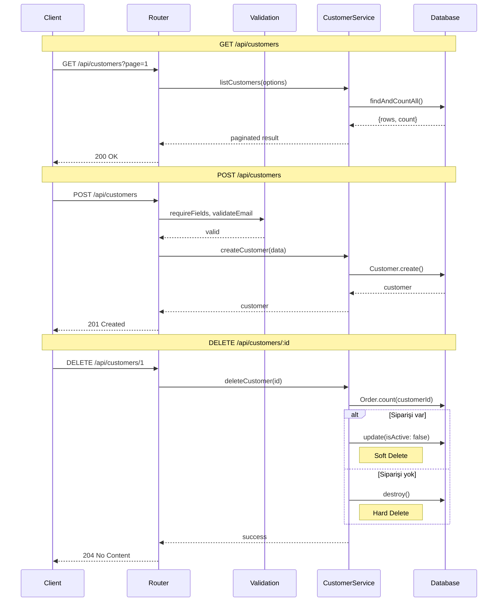
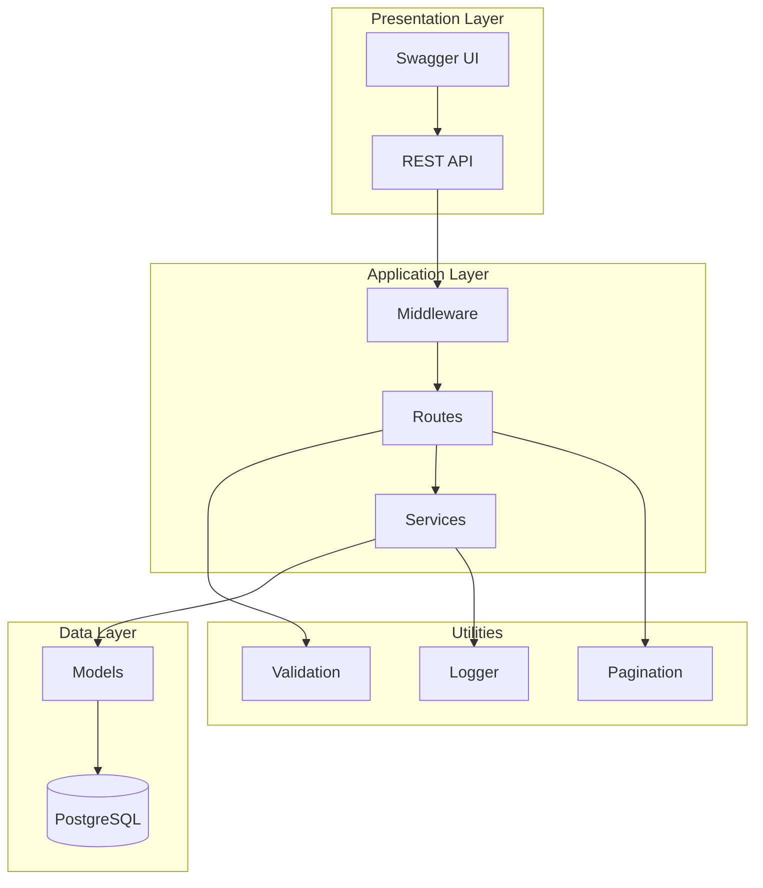
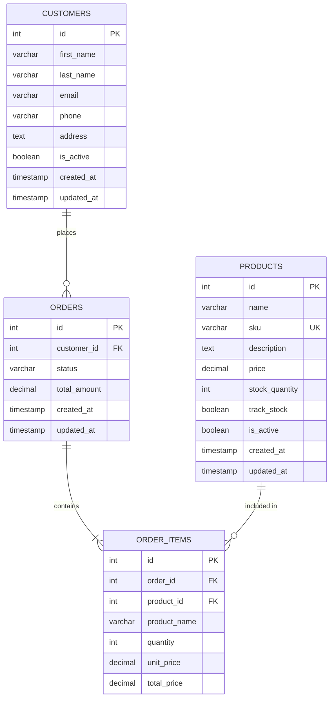

# Mini-CRM UML Diyagramları

## 1. Use Case Diyagramı

---

## 2. Class Diyagramı

---

## 3. Sequence Diyagramı - Sipariş Oluşturma

---

## 4. Sequence Diyagramı - Müşteri CRUD

---

## 5. Component Diyagramı

---

## 6. ER Diyagramı

